# Proof of Authority Development Chain
---
### Setting Up Blockchain Tools and MyCrypto Wallet
---
#### Go Ethereum Tool
1. Install [Go Ethereum Tools]("https://geth.ethereum.org/downloads/").
2. Make sure to install "**Geth & Tools 1.9.7**". For Windows, depending on your version, you should download the 32-bit or 64-bit version. 
3. After download, locate the file and decompress in a folder named **Blockchain-Tools**.
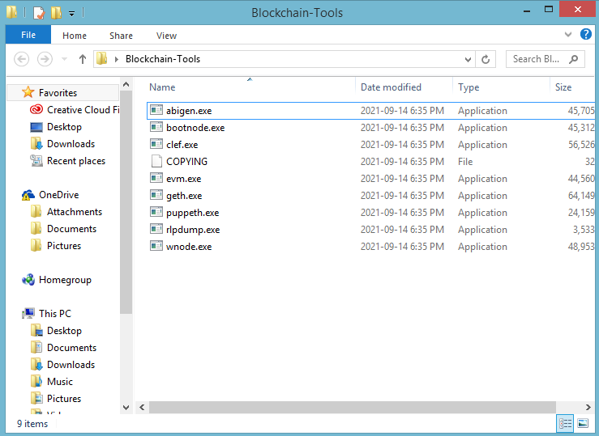
4. Your tools are set to start building your blockchain.

#### MyCrypto Wallet
1. Download [MyCrypto Wallet]("https://download.mycrypto.com/") that corresponds with your OS.
2. Once download is complete, open the file, and follow the installation wizard.
3. Your wallet is ready. You will use this later when making a transaction between two nodes/addresses.
---
### Getting Ready to Run the Blockchain Network
---
1. Copy all the folders(**node1**,**node2**, and **2chainz**) into the **Blockchain-Tools** folder.
2. If the nodes have not been initialized yet, initialize them now by inputting the following commands into gitbash while in the **Blockchain-Tools** directory one at a time.
- ./geth --datadir node1 init 2chainz/2chainz.json
- ./geth --datadir node2 init 2chainz/2chainz.json
3. Now that they are initialized, you can run the network.
---
### Running the Blockchain Network
---
1. Open a new instance of **Git Bash** and navigate to the **Blockchain-Tools** folder.
2. Run the first node using the geth command and input the provided address of **node1**.
- ./geth --datadir node1 --unlock "0x235E85066E3b50a9f19C6019C8EC11A1ec0Dc280" --mine --rpc --allow-insecure-unlock
- When prompted for a password, input: **123**
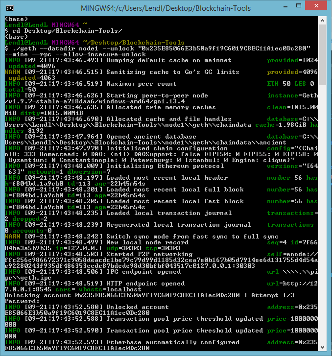
3. Open separate instance of **Git Bash** and navigate to the **Blockchain-Tools** folder.
4. Run the second node using the following geth command and input the provided address of **node2** and the enode of **node1**.
- ./geth --datadir node2 --unlock "0x763983205a697d5F9252DBCf3CC02129a8674290" --mine --port 30304 --bootnodes "enode://ffc256c986672371c9058deacdc1be79c79d99d1185d32cea7e0b167b05d7914ee6d131755d4d54ae92280243f935df486353ccdc87bdcde98d30bfbf043517c@127.0.0.1:30303" --ipcdisable --allow-insecure-unlock
- When prompted for a password, input: **123**
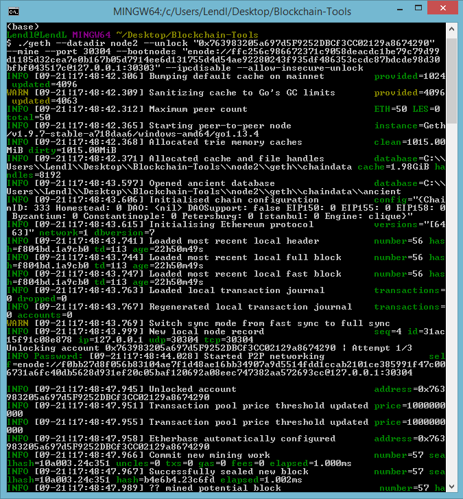
5. Perfect! Now that the nodes are up and running, we can send transactions between the two nodes.
---
### Connecting MyCrypto to the Network
---
1. With the two nodes up and running, open **MyCrypto**.
2. Click "**Change Network**" and "**Add Custom Node**".
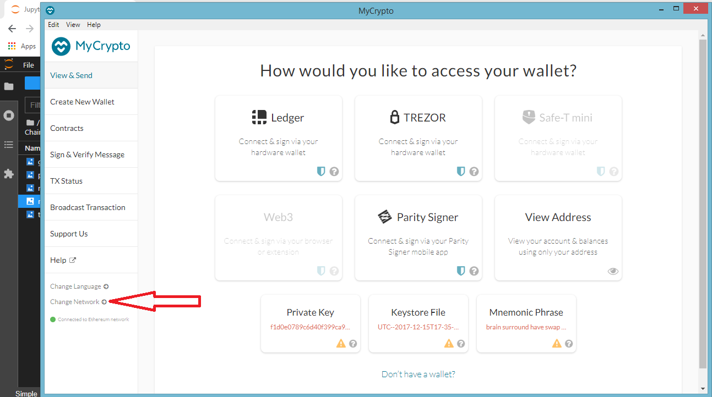
3. When the **Set Up Your Custom Node** window appears, change the "Network" column to **Custom**.
4. "Node Name" and "Network Name" should be the name of the build network provided, "**2chainz**".
5. Input "**ETH**" for "Currency" and "**333**" for "Chain ID".
- **333** is the Chain/Network ID that was created during the configuration of the genesis block.
6. Input **http://127.0.0.1:8545** in the "URL" field.
7. Save & Use Custom Node.

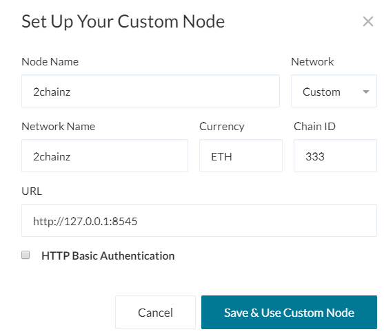

---
### Sending a Transaction
---
1. On the View & Send page of MyCrypto, click **Keystore File**.
2. Click **Select Wallet File** and select the "**UTC--2021-09-20T21-16-56.537392800Z--235e85066e3b50a9f19c6019c8ec11a1ec0dc280**" file in the "**node1**" folder.
3. Input the password as "**123**" and then **Unlock**
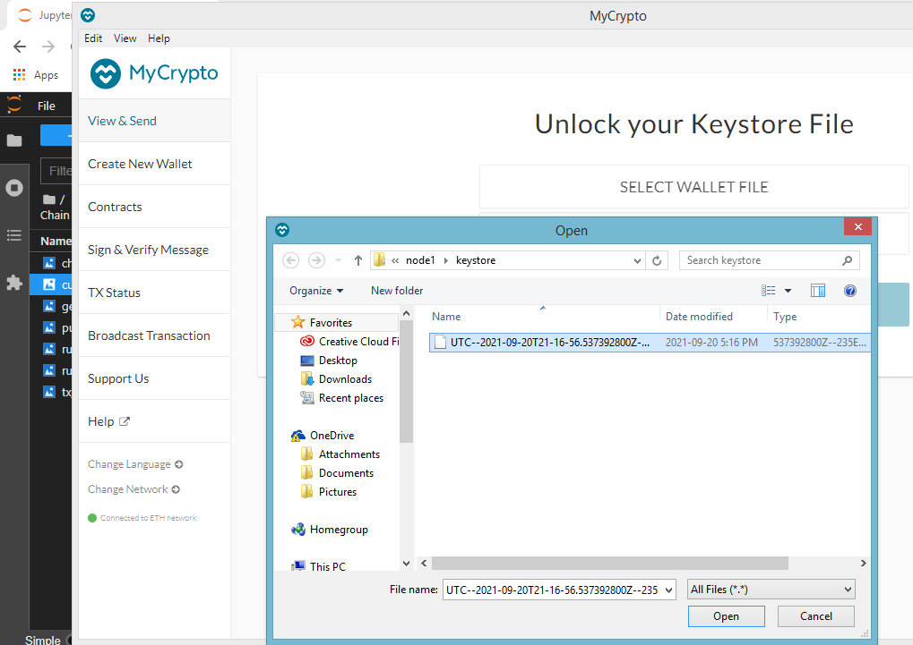
4. Now we will send some ETH from node1 to node2
5. Input the **node2** address in the "**To Address**" field:
- 0x763983205a697d5F9252DBCf3CC02129a8674290
6. We will send 500ETH in the "**Amount**" section and click **Send Transaction** and confirm the transaction.
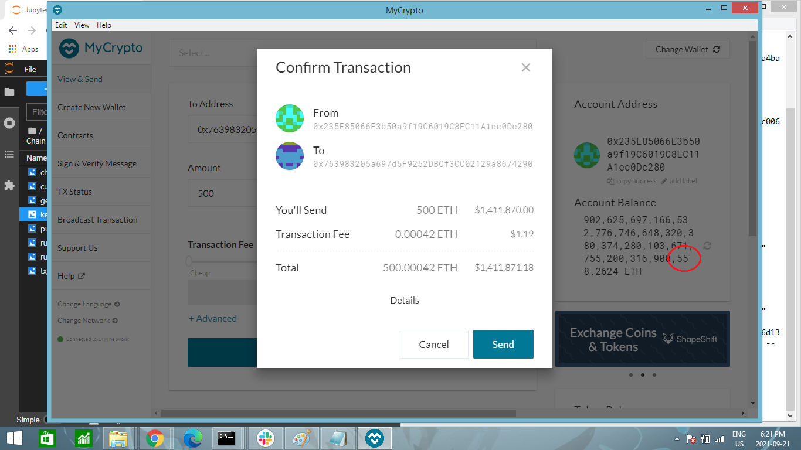
- Take note of the cirlced portion of the Account Balance in the picture above. After sending 500ETH, this will change accordingly. 
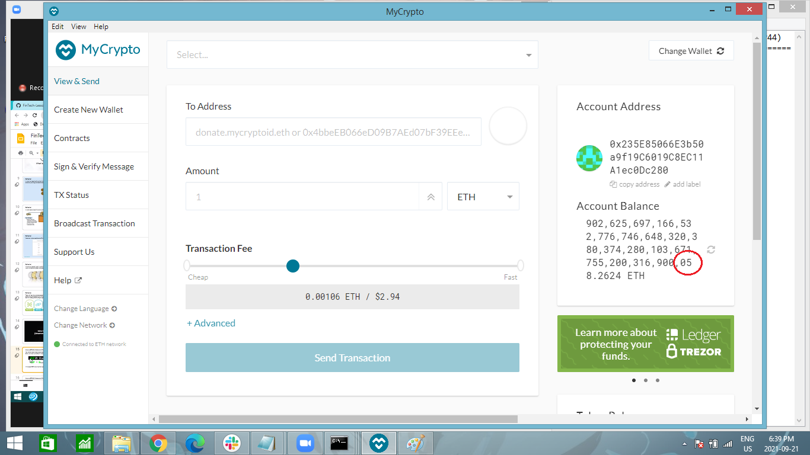
- The account balance is now 500ETH less than the previous account balance photo.
7. Copy the Transaction Hash and we will use it later to check the transaction.
- 0x592ae19242a416f2cd42132c6c195b51a640f20763fbc784f3dbd686ebef7c73
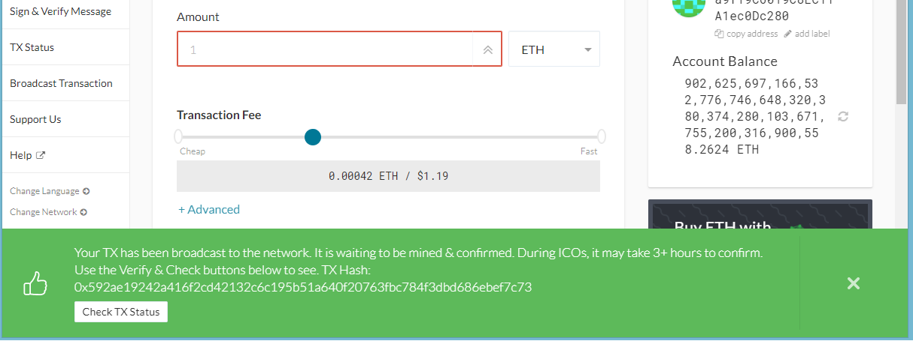
- You can see that the transaction went through here in the node1 window.
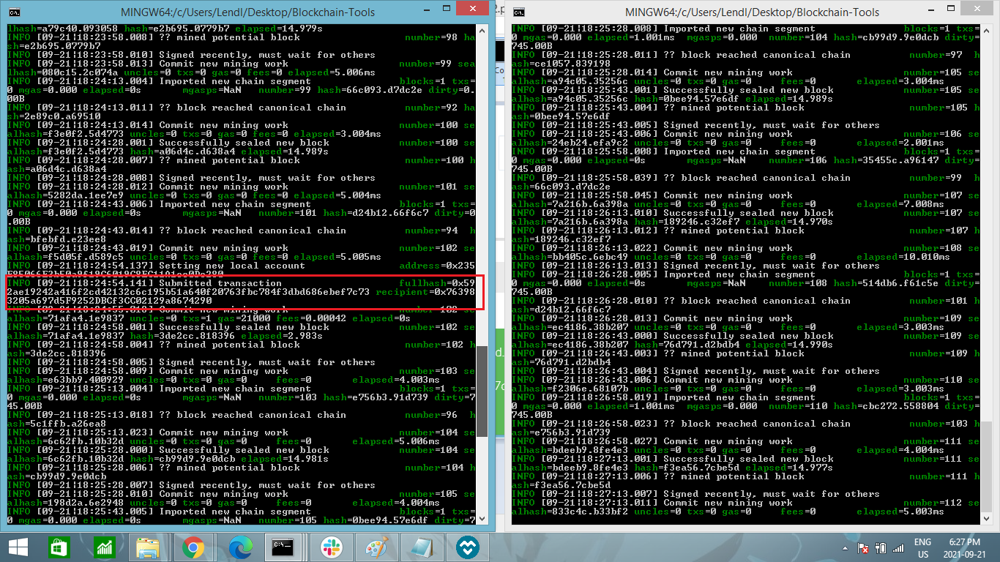
8. You've just sent ETH from one node to another!!
---
### Checking Transaction
---
1. Click on "**TX Status**" and you will be directed to the "**Check Transaction Status**" window.
2. Input the Transaction hash you copied earlier and **Check TX Status**.
- 0x592ae19242a416f2cd42132c6c195b51a640f20763fbc784f3dbd686ebef7c73
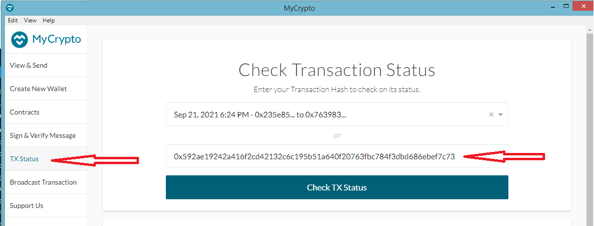
3. You should see the status of the transaction. It should say "Successful". If "Pending" is shown, keep both node1 and node2 gitbash window open for atleast 15 minutes, as that is the blocktime given during the creation of the genesis block.
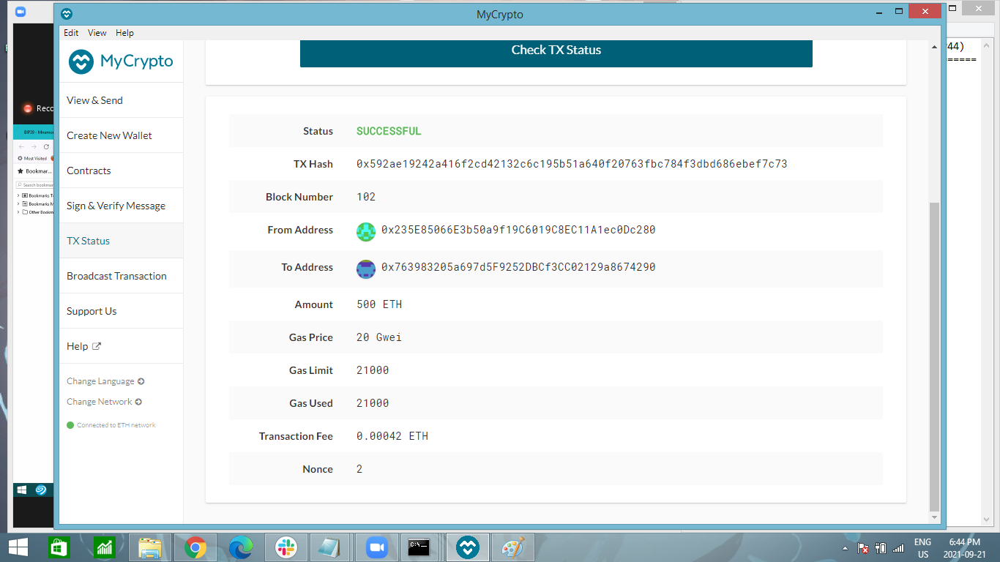
